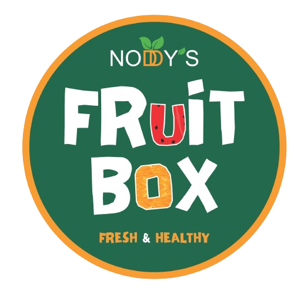

# Puzzle Games Collection

A modern collection of engaging browser-based puzzle games built with Next.js and Tailwind CSS. Challenge your mind with various puzzles designed to test different cognitive skills.



## Games

### Number Path (Available Now)
Connect numbers in sequence to solve challenging puzzles.

**Features:**
- Interactive grid-based gameplay
- Two carefully designed puzzles with multiple difficulty levels
- Connect dots in sequence (1 to 8) by drawing paths
- Real-time path visualization using HTML Canvas
- Drag-and-drop or tap interaction for seamless path creation
- Undo functionality for error correction
- Hint system to help with difficult puzzles
- Game completion tracking with stats
- Countdown timer for added challenge
- Backtrack counter to measure efficiency
- Responsive design for all device sizes
- Results page with time stats and sharing options

### Tango #197 (Coming Soon - June 2025)
A unique puzzle combining pattern recognition and strategy.

**Features:**
- Advanced pattern recognition challenges
- Daily puzzles with increasing difficulty
- Time trials to test speed and accuracy
- Colorful visual design with intuitive controls
- Development progress: 75% complete

### Queens #357 (Coming Soon - September 2025)
Classic chess-inspired puzzle with queen placement challenges.

**Features:**
- Chess strategy implementation in puzzle format
- Board mastery across different grid sizes
- Advanced challenges with unique positioning requirements
- Colorful purple-themed design
- Development progress: 35% complete

### Pinpoint #357 (Coming Soon - August 2025)
Test your precision and spatial awareness.

**Features:**
- Precision targeting on grid-based layouts
- Grid mastery with increasingly complex patterns
- Global ranking system for competitive play
- Blue-themed visual design
- Development progress: 45% complete

### Crossclimb (Coming Soon - December 2025)
Climb your way through crossword-style challenges.

**Features:**
- Vertical wordplay combining climbing and word mechanics
- Path building through crossword grids
- Time attack mode for speed challenges
- Teal-themed visual design
- Development progress: 25% complete

## Technical Features

- **Modern Tech Stack**: Built with Next.js, React, TypeScript, and Tailwind CSS
- **Responsive Design**: Works beautifully on all device sizes (mobile, tablet, desktop)
- **Accessible UI**: Designed with accessibility in mind
- **Interactive Elements**: Utilizing HTML Canvas for drawing and animations
- **Elegant Visual Design**: Colorful gradients and consistent design language
- **Client-side Game Logic**: State management using React hooks
- **SEO Optimized**: Proper metadata and page structure
- **Performance Optimized**: Fast loading times and smooth animations

## UI Components

- **Game Cards**: Consistent card components for game selection
- **Navigation System**: Easy navigation with back buttons
- **Progress Tracking**: Visual progress indicators
- **Colorful Icons**: Unique iconography for each game
- **Newsletter Signups**: Early access registration for upcoming games
- **Social Proof**: User community highlights
- **Results Display**: Beautiful presentation of game statistics

## Getting Started

First, run the development server:

```bash
npm run dev
# or
yarn dev
```

Open [http://localhost:3000](http://localhost:3000) with your browser to see the result.

## Deployment

This app is designed to be easily deployed on Vercel or any other Next.js-compatible hosting platform.

## License

[MIT](LICENSE)
